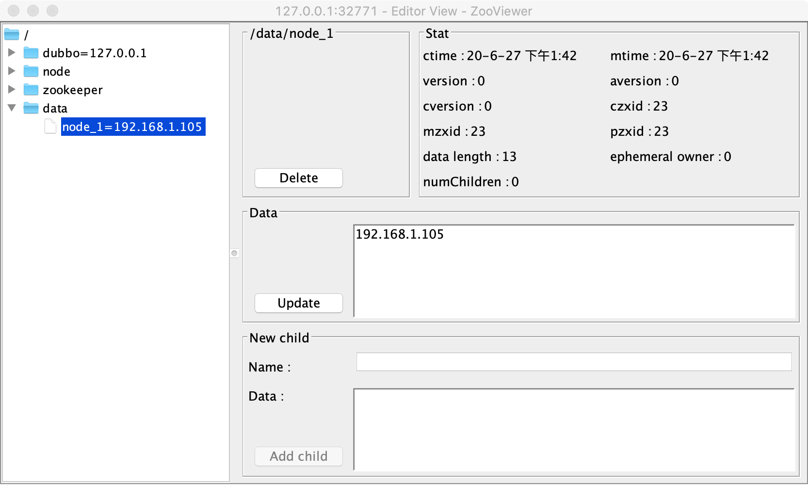
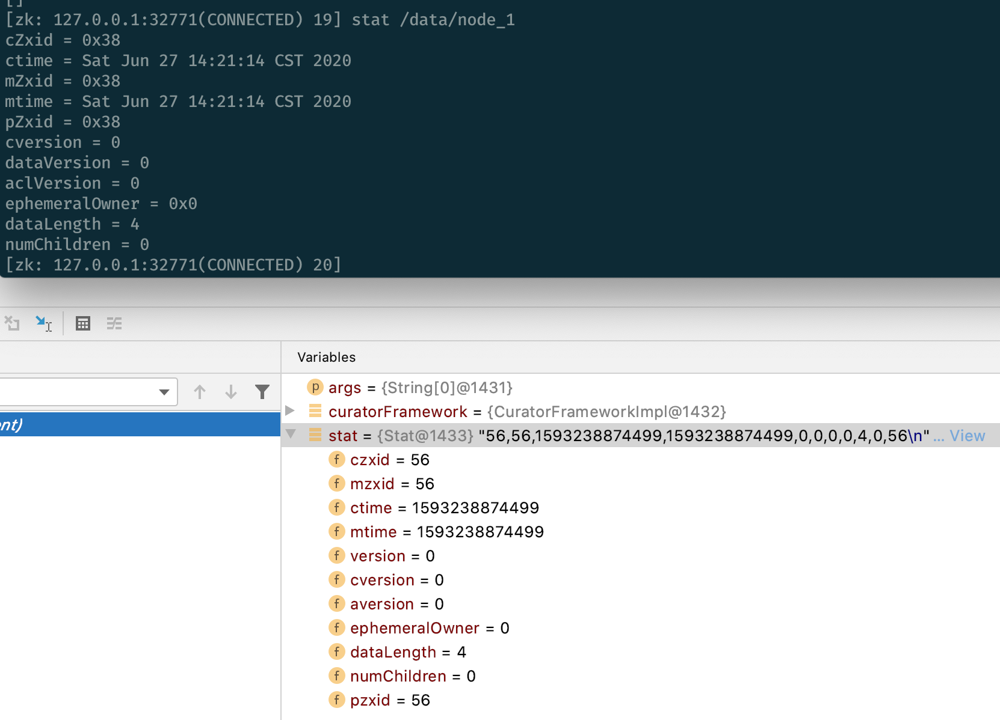

# zookeeper crud 

> author: [huifer](https://github.com/huifer)
>
> git_repo : [curator](https://github.com/SourceHot/curator)
>


## 依赖

```xml
<dependency>
    <groupId>org.apache.curator</groupId>
    <artifactId>curator-framework</artifactId>
    <version>5.0.1-SNAPSHOT</version>
</dependency>

```


## 实践
- 创建一个连接实例.如果是集群环境使用`,`逗号进行分割.

```java

        CuratorFramework build = CuratorFrameworkFactory.builder().sessionTimeoutMs(3000).connectString("127.0.0.1:32775")
                .retryPolicy(new ExponentialBackoffRetry(1000, 3)).build();


```

- 基本操作

```java
        // 启动
        curatorFramework.start();
        // CRUD
        // 创建数据
        curatorFramework.create();
        // 删除数据
        curatorFramework.delete();
        // 修改数据
        curatorFramework.setACL();
        // 获取数据
        curatorFramework.getData();
```

### 创建

```java
private static void createDate(CuratorFramework framework) throws Exception {
        framework.create().creatingParentsIfNeeded().forPath("/data/node_1");
    }
```

- 通常我们创建结点应该一层一层创建,使用 `creatingParentsIfNeeded`可以将上一层的结点给创建出来.





#### WithMode


```java
public interface CreateModable<T> {
    /**
     * Set a create mode - the default is {@link CreateMode#PERSISTENT}
     *
     * 创建节点的类型
     * @param mode new create mode
     * @return this
     */
    public T withMode(CreateMode mode);
}
```


存在如下几种节点类型


1. 持久化节点
1. 持久化有序节点
1. 临时节点
1. 临时有序节点
1. 容器节点
1. 持久的有过期时间的节点
1. 持久的并且有序的有过期时间的节点

- 默认持久化节点


#### forPath

~~~java
public interface PathAndBytesable<T> {
    /**
     * Commit the currently building operation using the given path and data
     * <p>
     * 创建一个节点并且赋予数据
     *
     * @param path the path 节点地址
     * @param data the data 数据
     * @return operation result if any
     * @throws Exception errors
     */
    T forPath(String path, byte[] data) throws Exception;

    /**
     * Commit the currently building operation using the given path and the default data
     * for the client (usually a byte[0] unless changed via
     * {@link CuratorFrameworkFactory.Builder#defaultData(byte[])}).
     * <p>
     * 创建节点.
     *
     * @param path the path 节点地址
     * @return operation result if any
     * @throws Exception errors
     */
    T forPath(String path) throws Exception;
}
~~~


- 连接到 zookeeper server


~~~shell
sh zkCli.sh -server 127.0.0.1:32771
~~~


```
[zk: 127.0.0.1:32771(CONNECTED) 6] ls /data
[node_1]
[zk: 127.0.0.1:32771(CONNECTED) 7]
```


### 修改


```java
private static void updateDate(CuratorFramework framework) throws Exception{
        framework.setData().forPath("/data/node_1","set_data".getBytes())
    }
```


- 执行前


~~~
[zk: 127.0.0.1:32771(CONNECTED) 7] get /data/node_1
192.168.1.105


~~~


- 执行后


~~~
[zk: 127.0.0.1:32771(CONNECTED) 8] get /data/node_1
set_data
~~~


### 删除


```java
private static void deleteDate(CuratorFramework framework) throws Exception {
        framework.delete().forPath("/data/node_1");
    }
```


#### withVersion

版本号使用. 乐观锁


```
[zk: 127.0.0.1:32771(CONNECTED) 12] stat /data/node_1
cZxid = 0x17
ctime = Sat Jun 27 13:42:34 CST 2020
mZxid = 0x2f
mtime = Sat Jun 27 14:09:45 CST 2020
pZxid = 0x17
cversion = 0
dataVersion = 2
aclVersion = 0
ephemeralOwner = 0x0
dataLength = 8
numChildren = 0
```

- withVersion 和 dataVersion 相关联


删除的时候如果version对不上会提示如下错误

~~~java
        framework.delete().withVersion(0).forPath("/data/node_1");
~~~


~~~java
Exception in thread "main" org.apache.zookeeper.KeeperException$BadVersionException: KeeperErrorCode = BadVersion for /data/node_1
	at org.apache.zookeeper.KeeperException.create(KeeperException.java:122)
	at org.apache.zookeeper.KeeperException.create(KeeperException.java:54)
	at org.apache.zookeeper.ZooKeeper.delete(ZooKeeper.java:2000)
	at org.apache.curator.framework.imps.DeleteBuilderImpl$5.call(DeleteBuilderImpl.java:244)
	at org.apache.curator.framework.imps.DeleteBuilderImpl$5.call(DeleteBuilderImpl.java:240)
	at org.apache.curator.RetryLoop.callWithRetry(RetryLoop.java:88)
	at org.apache.curator.framework.imps.DeleteBuilderImpl.pathInForeground(DeleteBuilderImpl.java:238)
	at org.apache.curator.framework.imps.DeleteBuilderImpl.forPath(DeleteBuilderImpl.java:225)
	at org.apache.curator.framework.imps.DeleteBuilderImpl.forPath(DeleteBuilderImpl.java:35)
	at org.source.hot.curator.client.Demo01.deleteDate(Demo01.java:42)
	at org.source.hot.curator.client.Demo01.main(Demo01.java:18)

~~~


- 通过 zookeeper-cli 中 **`stat`** 命令查看数据版本 为2 

- 执行

  ~~~java
          framework.delete().withVersion(2).forPath("/data/node_1");
  ~~~

  

- 此时在查看数据, 可以发现数据已经删除

~~~
[zk: 127.0.0.1:32771(CONNECTED) 15] ls /data
[]
~~~


#### 获取stat

- 先创建一个数据

  ~~~java
  private static void createDate(CuratorFramework framework) throws Exception {
          framework.create().creatingParentContainersIfNeeded().inBackground().forPath("/data/node_1", "test".getBytes());
      }
  ~~~

- 获取 stat

  ~~~java
  private static Stat getStat(CuratorFramework framework) throws Exception {
          Stat stat = new Stat();
          framework.getData().storingStatIn(stat).forPath("/data/node_1");
          return stat;
      }
  ~~~

  


- Cli 查看

~~~
[zk: 127.0.0.1:32771(CONNECTED) 19] stat /data/node_1
cZxid = 0x38
ctime = Sat Jun 27 14:21:14 CST 2020
mZxid = 0x38
mtime = Sat Jun 27 14:21:14 CST 2020
pZxid = 0x38
cversion = 0
dataVersion = 0
aclVersion = 0
ephemeralOwner = 0x0
dataLength = 4
numChildren = 0
~~~





## ACL


```java
private static void setAcl(CuratorFramework framework) throws Exception {
        List<ACL> list = new ArrayList<>();
        // acl , 权限,id(账号密码)
        ACL acl = new ACL(ZooDefs.Perms.READ, new Id("digest", DigestAuthenticationProvider.generateDigest("admin:admin")));
        list.add(acl);
        framework.create().withACL(list).forPath("/data/acl_1", "acl".getBytes());
    }
```


使用 cli 进行设置


```
[zk: 127.0.0.1:32771(CONNECTED) 21] set /data/acl_1 aaa
Authentication is not valid : /data/acl_1
```


查看权限

~~~
[zk: 127.0.0.1:32771(CONNECTED) 25] getAcl /data/acl_1
'digest,'admin:x
: r
~~~


- 修改成All权限

  ```
  ACL acl = new ACL(ZooDefs.Perms.ALL, new Id("digest", DigestAuthenticationProvider.generateDigest("admin:admin")));
  ```

  ```
  [zk: 127.0.0.1:32771(CONNECTED) 27] getAcl /data/acl_1
  'digest,'admin:x1nq8J5GOJVPY6zgzhtTtA9izLc=
  : cdrwa
  ```

- 修改

  ~~~
  [zk: 127.0.0.1:32771(CONNECTED) 28] set /data/acl_1 fff
  [zk: 127.0.0.1:32771(CONNECTED) 29] get /data/acl_1
  fff
  [zk: 127.0.0.1:32771(CONNECTED) 30]
  ~~~

  

**ALL使用读或写进行替代也可以**

- 权限类全路径： `org.apache.zookeeper.ZooDefs.Perms`

- 在配置权限的时候使用 `|` 进行分割

```java
        int ALL = READ | WRITE | CREATE | DELETE | ADMIN;
```

